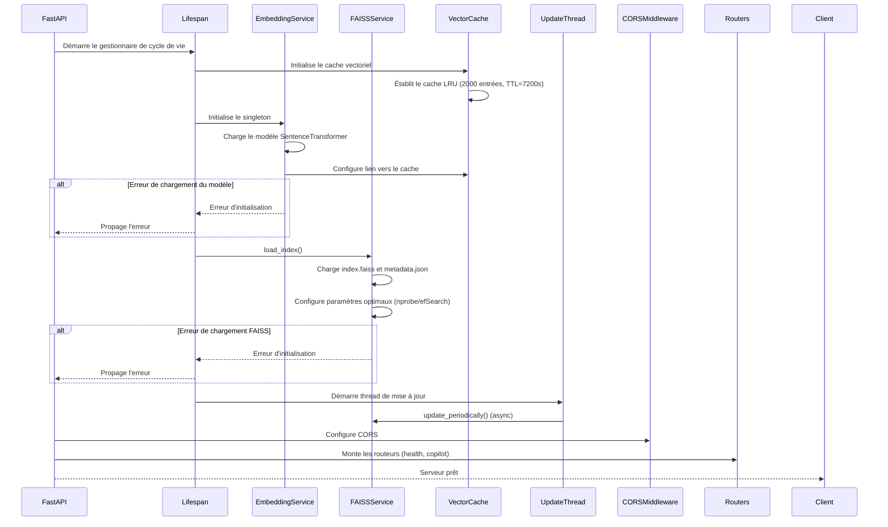
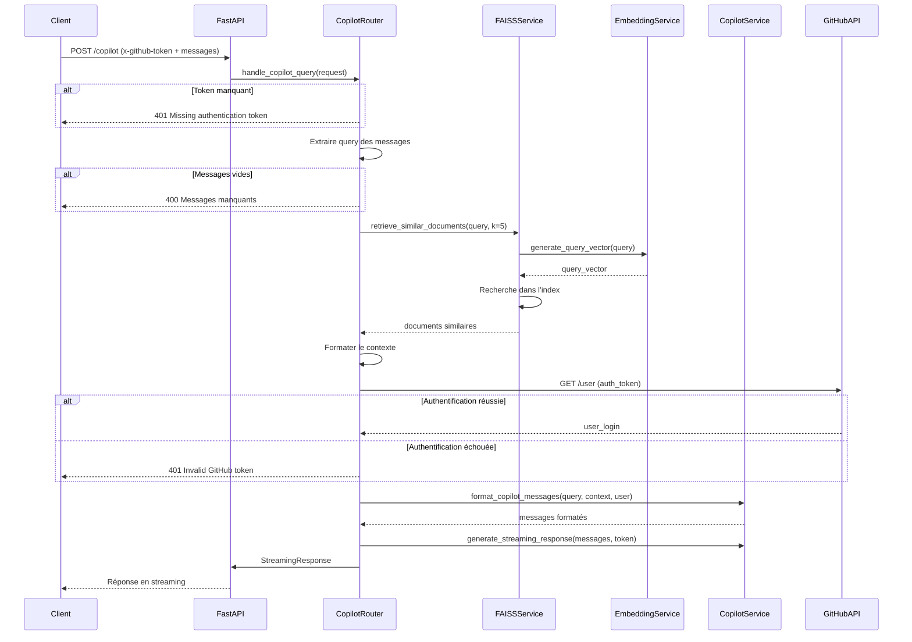

# GitHub Copilot Extension

## API FastAPI

### Objectif principal de l'API

API RESTful avec FastAPI pour un assistant GitHub Copilot. Elle récupère des embeddings issus de fichiers Markdown via FAISS, enrichit les requêtes utilisateurs avec des données contextuelles, et utilise un LLM pour générer des réponses. Un script automatisé met à jour quotidiennement l'index et synchronise les données vers AWS S3. L'API gère automatiquement la traduction entre le français et l'anglais pour assurer une meilleure correspondance entre les questions et la documentation.

### Architecture optimisée du système RAG

L'API REST suit un pipeline RAG (Retrieval-Augmented Generation) hautement optimisé, avec les caractéristiques suivantes :

1. **Segmentation intelligente des documents Markdown** : Analyse de structure avec chevauchement intelligent (50 caractères) et déduplication des segments trop similaires (seuil 0.85).

2. **Détection et traduction automatique** :
   - Détection automatique de la langue des questions entrantes
   - Traduction bidirectionnelle français-anglais avec M2M100 (version optimisée 418M)
   - Cache LRU pour les modèles de traduction et les résultats fréquents
   - Gestion robuste des erreurs pour assurer la continuité du service

3. **Indexation vectorielle performante** :
   - Sélection automatique du type d'index FAISS optimal selon la taille des données (FlatL2, IVF ou HNSW)
   - Paramètres de recherche configurables via FAISS_LANG et autres variables d'environnement
   - Optimisation des requêtes par langue pour une meilleure pertinence

4. **Cache vectoriel multi-niveau** : Mécanisme LRU (Least Recently Used) pour les embeddings et les résultats de recherche, avec TTL (Time-To-Live) de 2 heures.

5. **Prompts structurés pour le LLM** :
   - Extraction et priorisation automatique des faits clés
   - Formatage contexte en sections pertinentes
   - Conservation de la langue originale de l'utilisateur dans les réponses

6. **Récupération de données pertinentes** :
   - Recherche de documents similaires via FAISS avec paramètres optimisés
   - Traduction automatique du contexte si nécessaire
   - Équilibrage entre précision et performance

7. **Génération de réponses enrichies** :
   - Interrogation du LLM de GitHub Copilot avec contexte enrichi
   - Gestion intelligente des langues source et cible
   - Support multilingue transparent pour l'utilisateur

### Toolstack

- **FastAPI**: Framework API RESTful
- **Python**: Langage de programmation principal
- **Poetry**: Gestion des dépendances et packaging
- **pytest**: Tests unitaires et d'intégration
- **Pydantic V2**: Validation des données et sérialisation
- **uvicorn**: Serveur ASGI
- **SentenceTransformers**: Génération d'embeddings vectoriels
- **M2M100**: Traduction multilingue (facebook/m2m100_418M)
- **langdetect**: Détection de langue avec stabilisation
- **FAISS**: Base de données vectorielle optimisée
- **Boto3**: Interaction avec AWS S3
- **StreamingResponse**: Réponses en streaming
- **GitHub API**: Authentification et informations utilisateur
- **Copilot LLM API**: Génération de réponses contextuelles
- **Logging**: Journalisation et débogage
- **GitHub Actions**: CI/CD

### Diagrame de séquence sur demarrage du serveur



Explications :

- **FastAPI**: Démarre l'application et gère le cycle de vie.
- **Lifespan**: Gestionnaire de cycle de vie qui initialise les services essentiels.
- **VectorCache**: Service singleton qui gère le cache d'embeddings et de résultats.
- **EmbeddingService**: Service singleton qui charge le modèle SentenceTransformer et utilise le cache.
- **FAISSService**: Charge l'index vectoriel optimisé et les métadonnées associées.
- **UpdateThread**: Thread daemon qui met à jour périodiquement l'index FAISS.
- **CORSMiddleware**: Configure les politiques CORS.
- **Routers**: Monte les routeurs pour les endpoints health et copilot.

### Diagrame de séquence sur appel de l'API



Explications :

- **Client**: Envoie une requête POST avec un token GitHub et des messages.
- **FastAPI**: Délègue la requête au router Copilot.
- **CopilotRouter**:
  - Vérifie la présence du token et des messages.
  - Extrait la dernière question des messages.
  - Gère la recherche de documents similaires via FAISS.
  - Formate le contexte avec les documents trouvés.
  - Obtient les informations utilisateur via GitHub.
  - Formate les messages pour Copilot.
  - Configure la réponse en streaming.
- **FAISSService**:
  - Utilise EmbeddingService pour vectoriser la requête.
  - Recherche les documents similaires dans l'index.
- **EmbeddingService**: Génère les vecteurs d'embedding avec SentenceTransformer.
- **CopilotService**: Formate les messages et gère l'interaction avec l'API Copilot.
- **GitHubAPI**: Authentifie l'utilisateur et fournit ses informations.
- **FastAPI**: Retourne la réponse en streaming au client.

### Installation locale

- Installer les dépendances du projet avec Poetry.

```bash
pip install poetry
poetry install
poetry env activate
```

- Créer un fichier `.env` à la racine du projet avec les variables d'environnement nécessaires.

> Prendre exempl de `.env.example` et le renommer en `.env`.

- Lancer l'application FastAPI.

Utiliser le launcher de VSCode pour démarrer le serveur.
Puis accéder à l'API via `http://localhost:8000/` pour confirmer que tout va bien.

- Ouvrir le port 8000 dans l'onglet `PORTS` de VSCode
- Rendre l'URL Public
- Copier l'URL publique et la coller dans la GitHub App mode Copilot Extension

### Vérification de l'état de l'API

Vous pouvez vérifier si l'API fonctionne correctement en envoyant une requête de test à l'un des points de terminaison définis.

`http://localhost:8000/`

## Script Updater FAISS

### Objectif principal du script

Le script met à jour un index vectoriel (FAISS) en indexant des fichiers Markdown pour servir de base de connaissances à l'agent GitHub Copilot. L'index est mis à jour toutes les 24 heures via GitHub Actions.

### Architecture du script `/scripts/update_faiss.py`

1. **Extraction & Pré-traitement**
   - Clone ou mise à jour de multiples dépôts Git spécifiés via `REPO_URLS`
   - Lecture et traitement des fichiers Markdown avec détection et traduction automatique
   - Segmentation intelligente du contenu en unités sémantiques avec chevauchement

2. **Génération des embeddings**
   - Utilisation du modèle "all-MiniLM-L6-v2" pour générer les vecteurs
   - Cache vectoriel pour optimiser les performances
   - Support multilingue avec traduction automatique

3. **Persistance flexible**
   - Stockage local dans le dossier `/output` en mode développement
   - Synchronisation vers AWS S3 en production
   - Gestion automatique des environnements via la variable `ENV`

4. **Fiabilité et Robustesse**
   - Gestion des dépôts Git privés avec support PAT/JWT
   - Récupération sur erreur lors du clonage des dépôts
   - Support des systèmes de fichiers en lecture seule

### Outputs

Le script génère deux fichiers essentiels :

#### Le fichier `index.faiss`

Fichier binaire FAISS optimisé contenant :

- Vecteurs d'embedding normalisés
- Structure d'index pour recherche rapide (FlatL2/IVF/HNSW selon la taille)
- Mapping des IDs pour lier aux métadonnées

#### Le fichier `metadata.json`

JSON structuré contenant pour chaque vecteur :

- ID numérique unique
- Chemin du fichier source
- Contenu textuel du segment
- Métadonnées additionnelles (langue, section, etc.)

### Configuration du système

Le système peut être configuré via des variables d'environnement :

- **FAISS_LANG**: Langue principale de la documentation (default: "en")
- **LOG_LEVEL**: Niveau de journalisation (default: "INFO")
- **CORS_ORIGINS**: Origines autorisées pour CORS
- **ENV**: Environnement d'exécution (local/production)

Exemple de configuration dans `.env` :

```bash
FAISS_LANG=en
LOG_LEVEL=INFO
ENV=local
```

### Pipeline de traduction

Le système intègre un pipeline de traduction robuste :

1. **Détection de langue** :
   - Utilisation de langdetect avec seed fixe pour la stabilité
   - Validation supplémentaire avec dictionnaire de mots courants
   - Gestion des cas particuliers et des erreurs

2. **Traduction** :
   - Modèle M2M100 optimisé (418M paramètres)
   - Mise en cache du modèle avec @lru_cache
   - Traitement asynchrone pour les performances

3. **Optimisation** :
   - Cache LRU pour les résultats de traduction
   - Vérification de nécessité de traduction
   - Conservation du texte original en cas d'erreur

4. **Validation** :
   - Tests unitaires complets
   - Gestion des cas limites
   - Monitoring des performances
