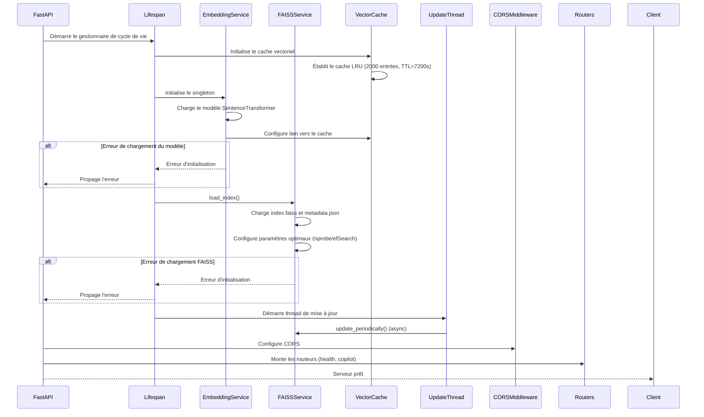
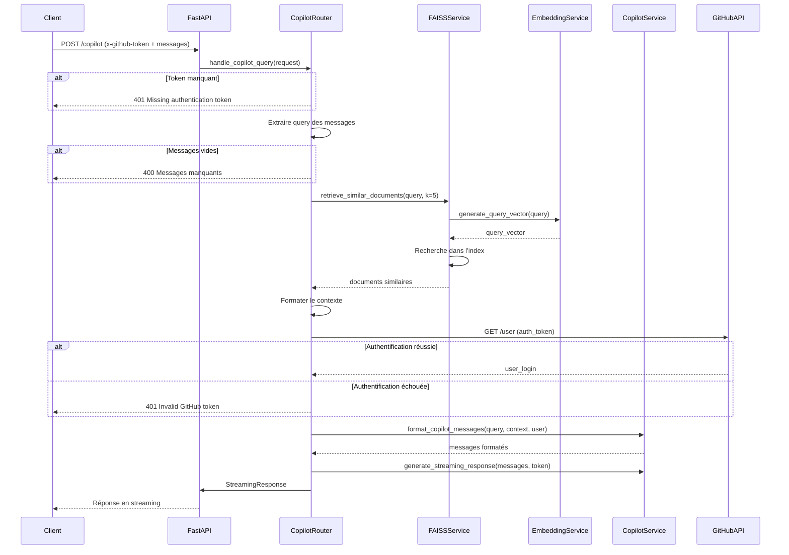

# GitHub Copilot Extension

## API FastAPI

### Objectif principal de l'API

API RESTful avec FastAPI pour un assistant GitHub Copilot. Elle récupère des embeddings issus de fichiers Markdown via FAISS et Chroma DB, enrichit les requêtes utilisateurs avec des données contextuelles, et utilise un LLM pour générer des réponses. Un script automatisé met à jour quotidiennement l'index et synchronise les données vers AWS S3.

### Architecture optimisée du système RAG

L'API REST suit un pipeline RAG (Retrieval-Augmented Generation) hautement optimisé, avec les caractéristiques suivantes :

1. **Segmentation intelligente des documents Markdown** : Analyse de structure avec chevauchement intelligent (50 caractères) et déduplication des segments trop similaires (seuil 0.85).

2. **Indexation vectorielle performante** : Sélection automatique du type d'index FAISS optimal selon la taille des données (FlatL2, IVF ou HNSW), avec paramètres de recherche configurables.

3. **Cache vectoriel multi-niveau** : Mécanisme LRU (Least Recently Used) pour les embeddings et les résultats de recherche, avec TTL (Time-To-Live) de 2 heures.

4. **Prompts structurés pour le LLM** : Extraction et priorisation automatique des faits clés, formatage contexte en sections pertinentes pour des réponses mieux structurées.

5. **Récupération de données pertinentes** : Recherche de documents similaires via FAISS avec paramètres optimisés, permettant d'équilibrer précision et performance.

6. **Génération de réponses enrichies** : Interrogation du LLM de GitHub Copilot avec contexte enrichi et formaté intelligemment.

### Toolstrack

- **FastAPI**: Utilisé pour créer l'API RESTful.
- **Python**: Langage de programmation utilisé pour le développement de l'API.
- **Poetry**: Outil de gestion des dépendances et de packaging pour Python.
- **pytest**: Utilisé pour les tests unitaires et d'intégration.
- **Pydantic**: Utilisé pour la validation des données et la sérialisation.
- **uvicorn**: Serveur ASGI pour exécuter l'application FastAPI.
- **SentenceTransformers**: Utilisé pour générer des embeddings vectoriels à partir de texte.
- **Chroma DB**: Base de données vectorielle pour le stockage et la recherche d'embeddings.
- **FAISS**: Base de données vectorielle optimisée avec paramètres dynamiques (nprobe, efSearch).
- **Boto3**: Utilisé pour interagir avec AWS S3, bien que cela ne soit pas directement visible dans cet endpoint, mais dans les fonctions auxiliaires.
- **StreamingResponse**: Utilisé pour envoyer des réponses de streaming à l'utilisateur.
- **GitHub API**: Utilisée pour authentifier l'utilisateur via le token GitHub (x-github-token) et récupérer des informations sur l'utilisateur.
- **Copilot LLM API**: API appelée pour générer une réponse basée sur la question et le contexte fourni.
- **Logging**: Utilisé pour enregistrer des informations sur le traitement des requêtes et le débogage.
- **GitHub Actions**: Utilisé pour l'intégration continue et le déploiement continu (CI/CD).

### Diagrame de séquence sur demarrage du serveur



Explications :

- **FastAPI**: Démarre l'application et gère le cycle de vie.
- **Lifespan**: Gestionnaire de cycle de vie qui initialise les services essentiels.
- **VectorCache**: Service singleton qui gère le cache d'embeddings et de résultats.
- **EmbeddingService**: Service singleton qui charge le modèle SentenceTransformer et utilise le cache.
- **FAISSService**: Charge l'index vectoriel optimisé et les métadonnées associées.
- **UpdateThread**: Thread daemon qui met à jour périodiquement l'index FAISS.
- **CORSMiddleware**: Configure les politiques CORS.
- **Routers**: Monte les routeurs pour les endpoints health et copilot.

### Diagrame de séquence sur appel de l'API



Explications :

- **Client**: Envoie une requête POST avec un token GitHub et des messages.
- **FastAPI**: Délègue la requête au router Copilot.
- **CopilotRouter**:
  - Vérifie la présence du token et des messages.
  - Extrait la dernière question des messages.
  - Gère la recherche de documents similaires via FAISS.
  - Formate le contexte avec les documents trouvés.
  - Obtient les informations utilisateur via GitHub.
  - Formate les messages pour Copilot.
  - Configure la réponse en streaming.
- **FAISSService**:
  - Utilise EmbeddingService pour vectoriser la requête.
  - Recherche les documents similaires dans l'index.
- **EmbeddingService**: Génère les vecteurs d'embedding avec SentenceTransformer.
- **CopilotService**: Formate les messages et gère l'interaction avec l'API Copilot.
- **GitHubAPI**: Authentifie l'utilisateur et fournit ses informations.
- **FastAPI**: Retourne la réponse en streaming au client.

### Installation locale

- Installer les dépendances du projet avec Poetry.

```bash
pip install poetry
poetry install
poetry env activate
```

- Créer un fichier `.env` à la racine du projet avec les variables d'environnement nécessaires.

> Prendre exempl de `.env.example` et le renommer en `.env`.

- Lancer l'application FastAPI.

Utiliser le launcher de VSCode pour démarrer le serveur.
Puis accéder à l'API via `http://localhost:8000/` pour confirmer que tout va bien.

### Vérification de l'état de l'API

Vous pouvez vérifier si l'API fonctionne correctement en envoyant une requête de test à l'un des points de terminaison définis.

`http://localhost:8000/`

## Script Update chroma

### Objectif principal du script

Mettre à jour quotidiennement (toutes les 24 heures) une base de données vectorielle Chroma DB indexant la documentation (environ 150 Mo de fichiers Markdown) pour servir un agent GitHub Copilot destiné à des centaines de développeurs.

### Contexte du script

Pour des fins de tests, 2 technologies utilisées:

- **Chroma DB**: Base de données vectorielle pour le stockage et la recherche d'embeddings. `/scripts/update_chroma.py`
- **FAISS**: Librairie de Facebook pour la recherche efficace d'embeddings. `/scripts/update_faiss.py`

### Architecture du script

- **Extraction & Pré-traitement:** Un script Python qui clônera le dépôt GitHub, lira et traitera les 100 fichiers Markdown pour les diviser en segments pertinents.
- **Génération des embeddings:** Pour chaque segment, on génère un vecteur d’embedding. Même si votre agent utilisera le LLM de Copilot pour répondre aux requêtes, il faut disposer d’un index efficace ; un modèle d’embedding léger et performant (comme « all-MiniLM-L6-v2 » par exemple) peut être utilisé pour obtenir une bonne qualité de recherche.
- **Indexation dans Chroma DB:** Les embeddings (avec leurs métadonnées, par exemple le nom du fichier, le contexte, etc.) sont stockés dans une instance de Chroma DB.
- **Persistance sur AWS S3:** La base vectorielle est persistée dans un dossier local, puis synchronisée vers votre bucket S3 (déjà protégé) pour un stockage centralisé et accessible depuis votre instance AWS.
- **Automatisation via GitHub Actions:** Une action planifiée (cron) déclenche l’exécution quotidienne du script pour mettre à jour la base vectorielle.

### Outputs

#### Le fichier .faiss

Ce fichier contient l'index vectoriel lui-même. C’est un binaire optimisé pour :

- Stocker les vecteurs (embeddings)
- Permettre une recherche rapide de similarité (approximate nearest neighbor search)
- Être chargé rapidement en mémoire pour faire des requêtes

Ce fichier est utilisé directement par FAISS au moment où tu fais une recherche. Il est donc crucial pour l’inférence.

### Le fichier .json

Ce fichier contient les métadonnées associées aux vecteurs. Typiquement :

- L’ID ou la clé de chaque vecteur
- Le contenu original (texte, titre, URL, etc.)
- Toute autre information utile à restituer quand tu fais une recherche

Quand tu fais une requête dans ton moteur de recherche vectoriel, tu obtiens un ou plusieurs vecteurs similaires depuis FAISS (grâce au .faiss), mais pour afficher les résultats à l’utilisateur, tu as besoin de retrouver ce que représentait chaque vecteur → c’est là que le .json est utile.
